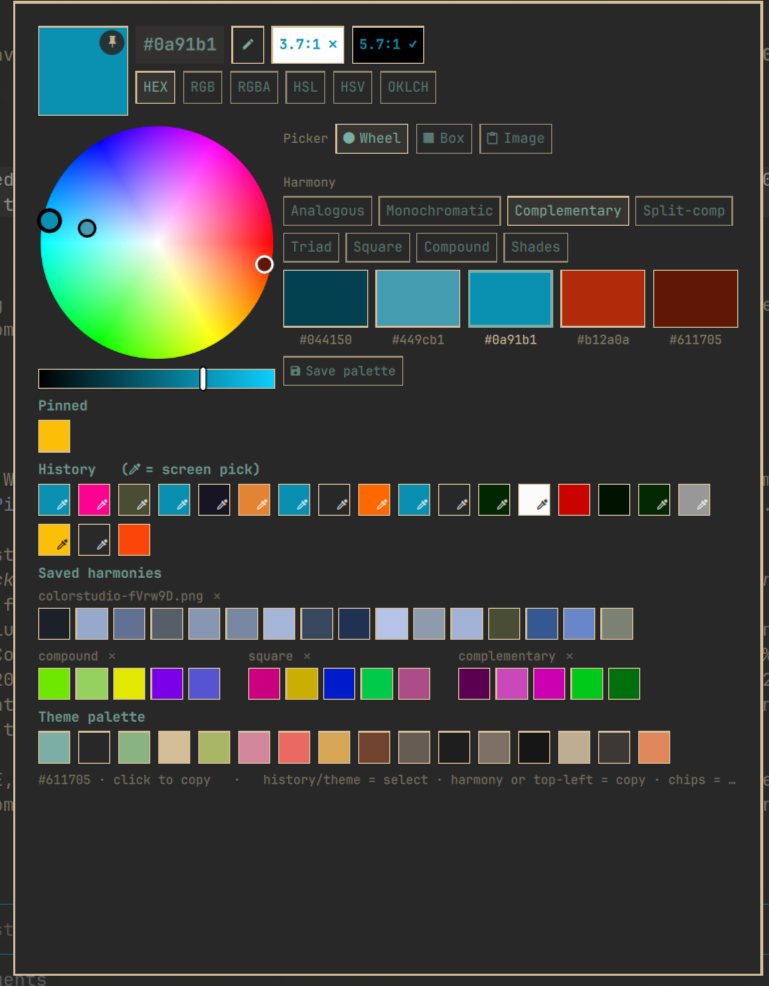

# Color Studio for Omarchy

A small color studio in your bar: pick colors from the screen, explore
harmonies on an Adobe-style wheel, pull palettes out of images, and copy
everything in the format you actually use.



## Install

Requires Omarchy 4.x (Quattro). Uses `hyprpicker` and ImageMagick's
`magick` (both ship with Omarchy) plus `wl-clipboard`. No other dependencies.

```bash
omarchy plugin add https://github.com/alexdont/color-studio.git --enable
```

Optional keybinding (add to `~/.config/hypr/bindings.lua`):

```lua
o.bind("SUPER + ALT + C", "Color studio", "omarchy-shell colorstudio toggle")
```

## Use

**Bar icon** — left-click picks a color from anywhere on screen (copied in
your chosen format, saved to history, shown as the dot on the icon).
Right-click opens the studio. IPC for scripting/keybindings:
`omarchy-shell colorstudio pick` and `omarchy-shell colorstudio toggle`.

**The studio** — three picker modes, remembered between sessions:

- **󰝥 Wheel** — an Adobe-style hue/saturation wheel with five markers.
  Pick a harmony rule (analogous, monochromatic, complementary,
  split-complementary, triad, square, compound, shades) and drag ANY
  marker — the others realign to keep the rule's geometry. Save palettes
  you like with **Save palette**.
- **󰝤 Box** — a classic saturation/value square with hue bar, plus a
  compact at-a-glance list of harmony families.
- **󰆒 Image** — paste (or drop, from any mode) an image and its 16
  dominant colors take the chooser's place. Clicking 󰆒 Image re-parses
  whatever image is on the clipboard; leaving the mode clears it.

**One interaction language everywhere:** history / pinned / theme swatches
*select* (become the working color, remembered across opens); harmony,
saved-set, and image swatches *copy* on left-click and *become the base*
on right-click; the top-left code or big swatch copies the working color.
Format chips (HEX · RGB · RGBA · HSL · HSV · OKLCH) switch the notation
used everywhere — including what screen picks copy. WCAG contrast vs
white and black is shown beside the code. The pencil edits/pastes a hex.

**Sections:** Pinned · History (eyedropper icon marks screen picks) ·
Saved harmonies (with per-set delete) · your active Omarchy theme palette.

## Remove

```bash
omarchy plugin remove io.github.alexdont.color-studio
```

State (history, pins, saved palettes) stays at
`~/.local/state/omarchy/io.github.alexdont.color-studio/`; delete that
folder too for a clean slate. The plugin never modifies other configuration
— the keybinding above is added by you.

## License

MIT
